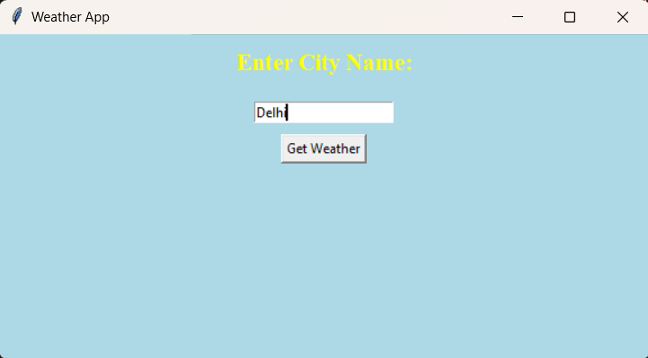
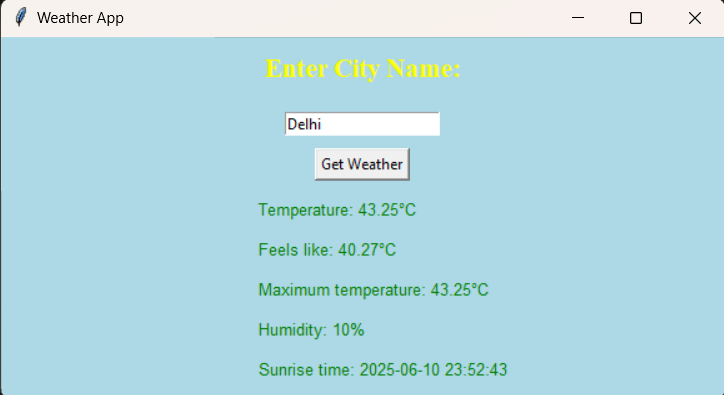

# 🌦️ Weather App

A **Python** GUI weather application for desktop using **Tkinter** and **OpenWeatherMap API** that fetches real-time weather data for any city worldwide.

## Preview

## Features

- Fetches weather for any city worldwide
- Displays:
  - Weather description
  - Current temperature
  - Feels-like temperature
  - Maximum temperature
  - Humidity
  - Sunrise and Sunset times (UTC)
- Clean GUI using Tkinter

##  Technologies Used

- Python 3
- Tkinter
- `requests` module
- OpenWeatherMap API

## 🔧 Setup and Usage

1. Clone the repository
   
git clone https://github.com/PavniR/weatherapp-python.git
run the command: cd weatherapp-python

2. Install required library
Make sure Python is installed, then install the required requests library: pip install requests

3. Run the application
Use this command (quotes are important because the filename has spaces):
python "weather api gui.py"

4. Use the App
Enter a city name in the input field (e.g., Delhi, New York, Paris).

Click "Get Weather".

The app will display weather info like temperature, humidity, and sunrise/sunset time.

## Author
Pavni Rastogi
